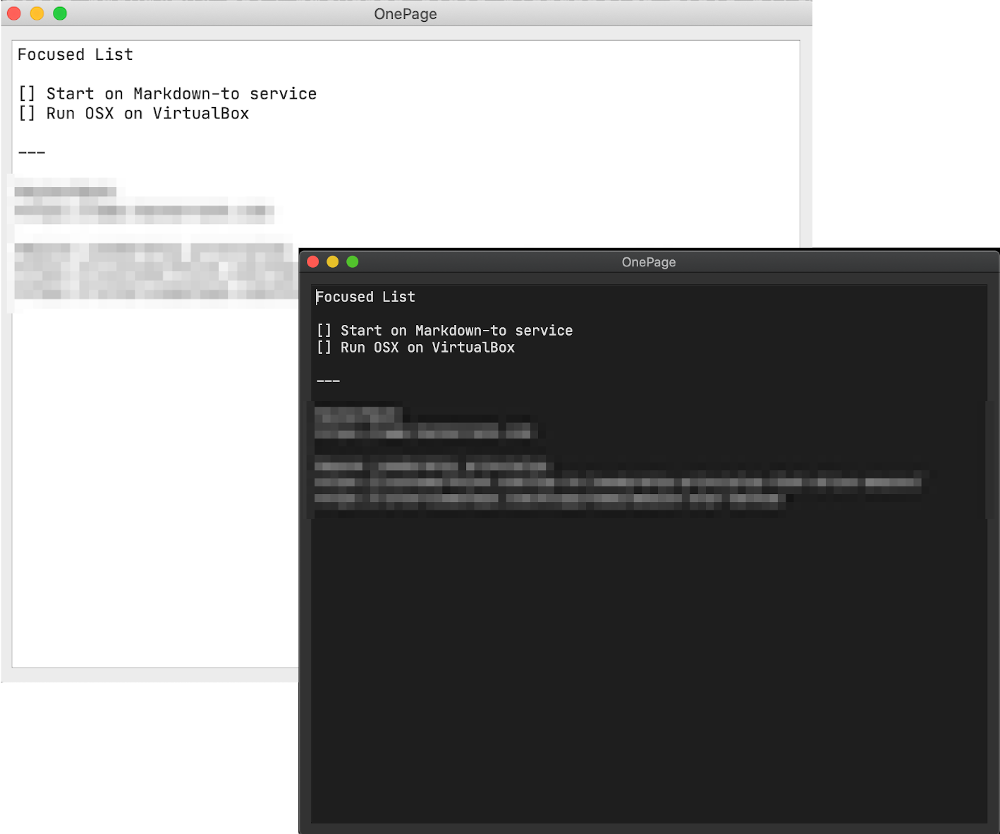

<p align="center">
  
</p>
<h1 align="center">PyQt Boilerplate</h1>  

   
### Features:

👉 Runnable application

👉 Application configuration using `.ini` files

👉 Separate requirements file for development and build

👉 Manage UI files and resources from QtDesigner

👉 Resource files and application icon

👉 Make file to set up virtualenv, run and test application

👉 Make command to generate code from QtDesigner generated `.ui` files

👉 Make command to generate and compress resource files

👉 Script to generate icons from SVG file (uses Inkscape)

👉 Stylesheets for switching between Light/Dark modes

👉 Rotating log file

👉 Application data persistence support using Sqlite database

### Light/Dark Themes



### Development

You'll need Python3.6+ to run this application.

The following make commands can be used for setting up virtual env and running the application.

Setup a new virtual env in venv folder and install all the dependencies listed in requirements/dev.txt

```
$ make setup
```

Run application
```
$ make run
```

Other useful commands

```
$ make help

 Choose a command run in pyqt-boilerplate:

black                          Runs black for code formatting
clean-pyc                      remove Python file artifacts
clean                          Clean package
icns                           Generates icon files from svg
lint                           Runs Flake8 for linting
release                        Step to prepare a new release
res                            Generates and compresses resource file
run                            Runs the application
setup                          Setup virtual environment and install dependencies
uic                            Converts ui files to python
venv                           Re-initiates virtualenv
```

### Application Icon

An example application icon is available in `resources/icons/app.svg`.
Run the following command to generate `.ico` and `.icns` files.
Note that it requires `Inkspace` to be available on the local machine.
Please check the following script to change location of `Inkscape`.

```
$ ./mk-icns.sh
```

### Credits

https://github.com/gmarull/pyside2-boilerplate
https://github.com/zenorocha/dracula-theme
https://icons8.com